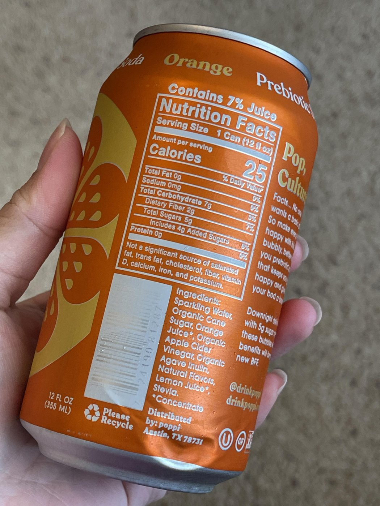
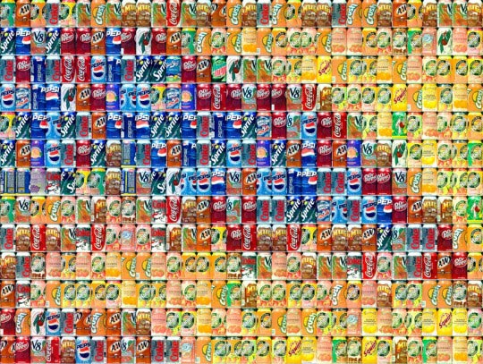
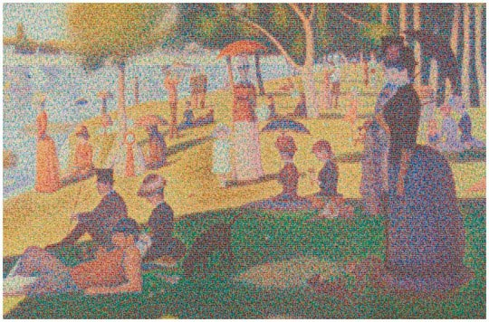
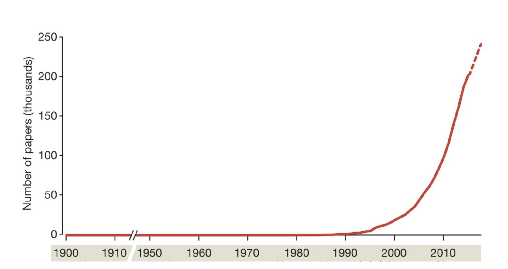
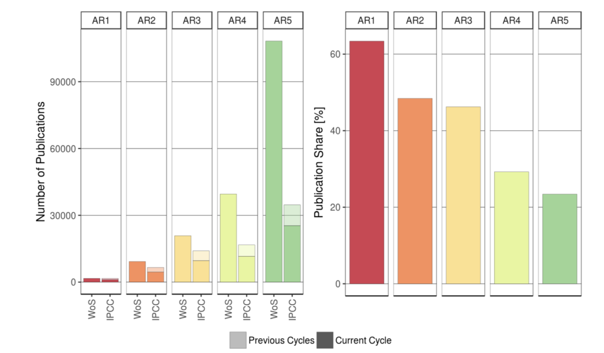
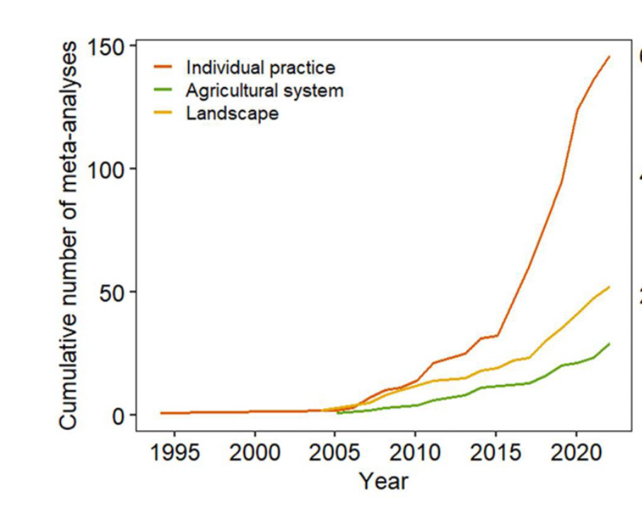
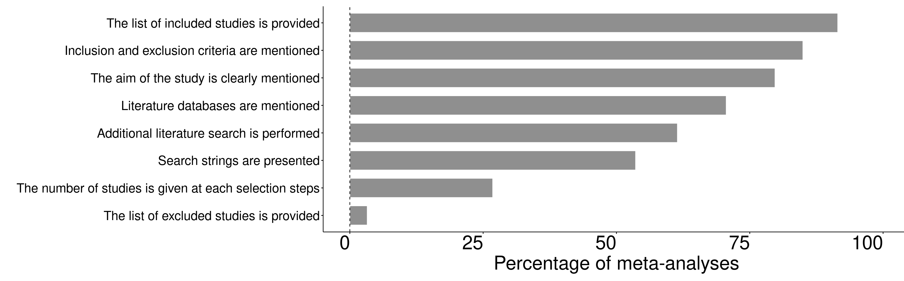

```{r}
#| label: setup
#| include: false
library(dplyr)
library(ggplot2)
library(metafor)
library(readr)
library(maps)
source("../../R/theme_cesab.R")
knitr::opts_chunk$set(dev = "png", dev.args = list(bg = "transparent"), out.width = "100%")

screen <- read_csv("../../donnees/derivees/screening_records.csv", show_col_types = FALSE)
comp   <- read_csv("../../donnees/derivees/comparisons_all.csv", show_col_types = FALSE)
ic     <- read_csv("../../donnees/derivees/intercropping_biodiversity.csv", show_col_types = FALSE)

n_screened  <- nrow(screen)
n_studies   <- n_distinct(comp$study_id)
n_comp      <- nrow(comp)
n_countries <- n_distinct(comp$country)

# Running example for the session: intercropping vs monoculture, pest abundance
pests <- ic |>
  filter(functional_group == "Pests", !sd_missing, !zero_mean) |>
  escalc(measure = "ROM",
         m1i = b_mean_t, sd1i = b_sd_t, n1i = b_n_t,
         m2i = b_mean_c, sd2i = b_sd_c, n2i = b_n_c, data = _)

# one random-effects summary per study (comparisons within a study vary too), only to *display* primary studies
first_author <- function(a) sub("^([^ ,]+).*", "\\1", a)
by_study <- pests |>
  group_by(study_id, authors, year) |>
  group_modify(~ {
    if (nrow(.x) == 1) {
      tibble(est = .x$yi, se = sqrt(.x$vi), k = 1L)
    } else {
      m <- tryCatch(rma(yi, vi, data = .x), error = function(e) rma(yi, vi, data = .x, method = "DL"))
      tibble(est = as.numeric(m$b), se = m$se, k = nrow(.x))
    }
  }) |>
  ungroup() |>
  mutate(lo = est - 1.96 * se, hi = est + 1.96 * se,
         label = paste0(first_author(authors), " et al. ", year),
         verdict = case_when(hi < 0 ~ "Fewer pests (significant)",
                             lo > 0 ~ "More pests (significant)",
                             TRUE   ~ "No significant effect")) |>
  mutate(label = ave(label, label, FUN = \(x) if (length(x) > 1) paste0(x, letters[seq_along(x)]) else x))

# the synthesis: three-level random-effects model (studies / effect sizes)
fit <- rma.mv(yi, vi, random = ~ 1 | study_id / es_id, data = pests, test = "t", dfs = "contain")
pr  <- predict(fit)

# same model restricted to comparisons meeting all validity criteria
fit_valid <- rma.mv(yi, vi, random = ~ 1 | study_id / es_id, test = "t", dfs = "contain",
                    data = filter(pests, validity_biodiv == 1))
pr_valid  <- predict(fit_valid)
pc <- function(x) round(100 * (exp(x) - 1))   # lnRR -> % change

# forest plot of individual studies, reused on several slides
pal <- c("Fewer pests (significant)" = cesab[["blue"]],
         "No significant effect"     = "#9AA8B1",
         "More pests (significant)"  = cesab[["warn"]])
lvl <- by_study |> arrange(est) |> pull(label)
forest_studies <- function(show) {
  by_study |>
    mutate(label = factor(label, levels = lvl),
           alpha = ifelse(label %in% show, 1, 0)) |>
    ggplot(aes(est, label, colour = verdict, alpha = alpha)) +
    geom_vline(xintercept = 0, linetype = 2, colour = cesab[["grey"]]) +
    geom_errorbarh(aes(xmin = lo, xmax = hi), height = 0, linewidth = 1.1) +
    geom_point(size = 3.2) +
    scale_alpha_identity() +
    scale_y_discrete(labels = \(x) ifelse(x %in% show, x, "")) +
    scale_colour_manual(values = pal, name = NULL, drop = FALSE) +
    scale_x_continuous(labels = \(x) pct(x), breaks = log(c(0.1, 0.25, 0.5, 1, 2))) +
    coord_cartesian(xlim = log(c(0.03, 3.5))) +
    labs(x = "Pest abundance, intercropping vs monoculture", y = NULL) +
    theme_cesab(18) +
    theme(axis.text.y = element_text(size = 13))
}
```

## Learning objectives {.objectives}

By the end of this session, you will be able to:

1.  Explain **why a single study is not enough** to answer an applied question.
2.  **Distinguish** a narrative review, a systematic map, a systematic review and a meta-analysis — and say what each can and cannot tell you.
3.  Name the **standards** that make a synthesis trustworthy (CEE, Cochrane, PRISMA 2020, ROSES).
4.  Place **each step of this week** in the workflow of a systematic review.

::: notes
45 min in total. ~1 min here. Say explicitly: "Today is the map of the week: every other session zooms into one box of the workflow I show at the end."
:::

# Look closer, then step back {.section-divider background-image="../../theme/img/bg-keymessages.jpg"}

## One study...

::: {.columns}
::: {.column width="38%"}
::: {style="margin-top:30%;"}
[What is this?]{.big}

<br>

[One can. Clear, precise, detailed.]{.fragment .muted}
:::
:::

::: {.column width="60%" .img-frame}
{height="700px" fig-align="center"}
:::
:::

::: notes
Let the room answer. Obvious: a soda can. Precise and detailed — like one well-conducted field experiment.
:::

## Many studies...

::: {.columns}
::: {.column width="38%"}
::: {style="margin-top:30%;"}
[And now?]{.big}

<br>

[Many cans. Each one looks different.]{.fragment .muted}
:::
:::

::: {.column width="60%" .img-frame}
{width="100%" fig-align="center"}
:::
:::

## ...and the big picture

::: {.columns}
::: {.column width="38%"}
::: {.fragment}
Georges Seurat's *A Sunday Afternoon on the Island of La Grande Jatte*, rebuilt from **106,000 cans**.
:::

::: {.fragment .box .blue}
**One study = one can.**\
A synthesis reveals a pattern that no single study shows — but it can also **hide the details** of each can.
:::
:::

::: {.column width="60%" .img-frame}
{width="100%" fig-align="center"}
:::
:::

::: {.source}
Chris Jordan, *Cans Seurat* (2007), series *Running the Numbers*: 106,000 aluminium cans, the number used in the US every 30 seconds.
:::

::: notes
Key message of the hook — say it out loud; it comes back at the end ("strengths and limits"): see the forest for the trees, but you may miss individual trees.
:::

# Our question: one study, or all of them? {.section-divider background-image="../../theme/img/bg-keymessages.jpg"}

## In medicine: one study, twelve children, one retraction

::: {.columns}
::: {.column width="62%"}
| Year | What happened |
|------|---------------|
| **1998** | Wakefield et al. (*The Lancet*): case series of **12 children**, suggests a link between the MMR vaccine and autism. Press conference, huge media coverage. |
| 1998–2004 | MMR vaccination coverage falls in the UK; measles returns. |
| 2004 | 10 co-authors retract the paper's interpretation. |
| **2010–11** | *The Lancet* fully retracts the paper; Wakefield is struck off; the *BMJ* shows the data were **fraudulent**. |
| **2014** | Meta-analysis of 5 cohort (1.26 million children) and 5 case-control studies: **no association** between vaccination and autism. |
:::

::: {.column width="36%"}
::: {.fragment .box .warn}
[A single, vivid study]{.box-title}
small sample, no control group, conflicts of interest — but enormous influence.
:::

::: {.fragment .box .green}
[The weight of evidence]{.box-title}
all eligible studies, weighted by their precision, appraised for bias.
:::
:::
:::

::: {.source}
Source: @wakefield1998; @godlee2011; @taylor2014 (cohorts: 1,256,407 children; case-control: 9,920).
:::

::: notes
~2 min. Keep it short and factual: the point is not vaccines but how much harm a single study can do when it is not weighed against the rest of the evidence. Transition: "Now a question from our own field."
:::

## Our running example this week

::: {.columns}
::: {.column width="40%"}
::: {.box .blue}
[The question]{.box-title}
Does **diversifying farms** (intercropping, agroforestry, rotations...) benefit **biodiversity** — without costing **yield**?
:::

A published systematic map [@jones2021] (partly built from earlier meta-analyses):

-   **`r format(n_screened, big.mark = ",")`** records screened
-   **`r n_studies`** studies · **`r format(n_comp, big.mark = ",")`** comparisons
-   **`r n_countries`** countries · 1986–2021

We use it **all week**: map, effect sizes, models, bias.
:::

::: {.column width="58%"}
```{r}
#| label: plot-world
#| fig-width: 9
#| fig-height: 5.6
world <- map_data("world")
by_country <- comp |>
  mutate(region = recode(country, "United States of America" = "USA",
                         "United Kingdom" = "UK", "Viet Nam" = "Vietnam")) |>
  group_by(region) |> summarise(n_studies = n_distinct(study_id))
world |>
  left_join(by_country, by = "region") |>
  ggplot(aes(long, lat, group = group, fill = n_studies)) +
  geom_polygon(colour = "white", linewidth = 0.1) +
  scale_fill_gradient(low = "#C9E7E7", high = cesab[["blue"]], na.value = "#E9EEF0",
                      name = "Studies") +
  coord_quickmap(ylim = c(-55, 75)) +
  theme_void(base_size = 17, base_family = "Poppins") +
  theme(legend.position = "bottom", legend.key.width = unit(1.6, "cm"))
```
:::
:::

::: notes
~2 min. Introduce the dataset as a character of the week: everybody works on the same question, so every method is shown on the same data. The map already hints at a bias: most studies come from the Americas, Europe and China.
:::

## Quick poll {.question}

::: question-card
[Show of hands]{.q-kicker}

[Compared with a monoculture, does **intercropping** reduce the abundance of **crop pests**?]{.q-text}
:::

::: answers
-   Yes, clearly
-   No
-   It depends
:::

::: notes
Expect a split room. Keep the votes in mind: the next slides show what individual studies — and then the synthesis — say.
:::

## If you had read only one study...

```{r}
#| label: plot-one-study
#| fig-width: 12.5
#| fig-height: 6.6
forest_studies(show = lvl[length(lvl)])
```

::: {.fragment .box .warn style="position:absolute; top:52%; left:60%; width:36%;"}
**`r lvl[length(lvl)]`**: intercropping **increases** pest abundance (`r pct(max(by_study$est))`). Conclusion: avoid intercropping?
:::

::: notes
~1 min. One can. One study, significant, published in a good journal. Many papers and policy briefs cite one or two studies like this one.
:::

## ...or another one

```{r}
#| label: plot-two-studies
#| fig-width: 12.5
#| fig-height: 6.6
forest_studies(show = c(lvl[length(lvl)], lvl[1]))
```

::: {.fragment .box .green style="position:absolute; top:52%; left:60%; width:36%;"}
**`r lvl[1]`**: intercropping **cuts** pests (`r pct(min(by_study$est))`). Conclusion: intercrop everywhere?
:::

## Primary studies disagree

```{r}
#| label: plot-studies
#| fig-width: 12.5
#| fig-height: 6.1
forest_studies(show = lvl)
```

::: {.source}
Source: `r nrow(by_study)` studies, `r nrow(pests)` comparisons from @jones2021. One point per study (random-effects summary of its comparisons), 95% CI.
:::

::: notes
~2 min. Count the colours with the room: mostly significant decreases, several non-significant, two significant increases. Counting "significant" studies (vote counting) is NOT a synthesis: it ignores effect size and precision.
:::

## A synthesis sees the pattern — and its spread

::: {.columns}
::: {.column width="58%"}
```{r}
#| label: plot-pooled
#| fig-width: 8.5
#| fig-height: 5.6
pooled <- tibble(
  what = factor(c("Average effect (95% CI)", "Where a new study may fall\n(95% prediction interval)"),
                levels = rev(c("Average effect (95% CI)", "Where a new study may fall\n(95% prediction interval)"))),
  est = pr$pred, lo = c(pr$ci.lb, pr$pi.lb), hi = c(pr$ci.ub, pr$pi.ub))
ggplot(pooled, aes(est, what)) +
  geom_vline(xintercept = 0, linetype = 2, colour = cesab[["grey"]]) +
  geom_errorbarh(aes(xmin = lo, xmax = hi, colour = what), height = 0, linewidth = 3) +
  geom_point(shape = 23, size = 8, fill = cesab[["blue"]], colour = "white") +
  scale_colour_manual(values = c(cesab[["teal"]], cesab[["blue"]]), guide = "none") +
  scale_x_continuous(labels = \(x) pct(x), breaks = log(c(0.25, 0.5, 1, 2))) +
  coord_cartesian(xlim = log(c(0.18, 3))) +
  labs(x = "Pest abundance, intercropping vs monoculture", y = NULL) +
  theme_cesab(17)
```
:::

::: {.column width="40%"}
::: {.fragment}
On average, intercropping **reduces pests by `r round(100 * (1 - exp(pr$pred)))`%**\
(95% CI: `r round(100 * (1 - exp(pr$ci.ub)))`–`r round(100 * (1 - exp(pr$ci.lb)))`% reduction).
:::

::: {.fragment .box}
But in a new field, the effect could be anywhere from **`r pct(pr$pi.lb)`** to **`r pct(pr$pi.ub)`**.\
→ The honest answer to the poll was **"it depends"**.
:::
:::
:::

::: {.source}
Random-effects meta-analysis accounting for several comparisons per study: k = `r fit$k` comparisons, `r fit$s.nlevels[1]` studies. You will fit this model on Wednesday.
:::

::: notes
~3 min. Two numbers to remember: the mean (and its CI) and the prediction interval. In ecology, heterogeneity is the rule (median I² ≈ 90% across ecological meta-analyses, Senior et al. 2016). Explaining *why* it varies (crop, pest type, region) is the job of moderators — Wednesday afternoon.
:::

## Two intervals, two questions

::: {.columns}
::: {.column width="50%"}
::: {.box .blue}
[Confidence interval (CI)]{.box-title}
*How precisely do we know the **average** effect?*

`r pc(pr$ci.lb)`% to `r pc(pr$ci.ub)`% → shrinks as studies accumulate.
:::

::: {.box}
[Prediction interval (PI)]{.box-title}
*What effect should we expect in a **new field**?*

`r pc(pr$pi.lb)`% to +`r pc(pr$pi.ub)`% → does **not** shrink to zero with more studies: it reflects **real differences** between sites, crops and pests.
:::
:::

::: {.column width="48%"}
::: {.box .green}
[Heterogeneity (τ²)]{.box-title}
The **spread of the true effects** (between studies, and between comparisons within studies). Here the true effect differs from field to field — which is why the PI is wide.

In ecology this is the rule, not the exception [@senior2016].
:::

::: {.fragment .box .warn}
Report the mean **with** its prediction interval. Explaining the spread (crop, pest group, region) is the job of **moderators** — Wednesday afternoon.
:::
:::
:::

::: notes
~2 min. Intuition first, formulas on Wednesday. CI = precision of the mean (sampling uncertainty of the average); PI = where 95% of true effects of comparable new studies should lie; tau² = variance of true effects. Don't mention the three-level structure here.
:::

# Why we need synthesis {.section-divider background-image="../../theme/img/bg-keymessages.jpg"}

## Too much to read

::: {.columns}
::: {.column width="48%"}
{width="100%"}

::: small
Publications grow exponentially — today **> 3 million** peer-reviewed articles per year across all sciences [@stm2018].
:::
:::

::: {.column width="50%"}
{width="100%"}

::: small
IPCC assessments cite a **shrinking share** of the relevant literature at each cycle.
:::
:::
:::

::: {.source}
Left: @gurevitch2018. Right: @minx2017.
:::

::: notes
~1.5 min. No expert can read everything anymore — even the IPCC. Synthesis is not optional; the question is whether it is done well.
:::

## Syntheses boom...

::: {.columns}
::: {.column width="55%"}
{width="100%"}
:::

::: {.column width="43%"}
Cumulative number of meta-analyses on **crop diversification**, by scale of the practice.

::: {.fragment .box .warn}
Dozens of meta-analyses on crop diversification...\
Do they agree? Can we trust them?
:::
:::
:::

::: {.source}
Source: @beillouin2019 and updates.
:::

::: notes
~1 min. Transition to quality.
:::

## ...but their quality varies

::: {.columns}
::: {.column width="58%"}
{width="100%"}

::: small
Share of meta-analyses on crop diversification reporting each item.
:::
:::

::: {.column width="40%"}
::: {.box .blue}
[Reporting standards]{.box-title}
**PRISMA 2020** [@page2021]\
**PRISMA-EcoEvo** [@odea2021]\
**ROSES** [@haddaway2018]
:::

::: {.box .green}
[Appraising a synthesis]{.box-title}
CEESAT [@woodcock2014]\
Ten appraisal questions [@nakagawa2017]
:::
:::
:::

::: {.source}
Source: @beillouin2019 and updates.
:::

::: notes
~2 min. Many meta-analyses do not report their search strings, their excluded studies... A meta-analysis is only as good as the systematic review behind it. Joseph covers reporting standards on Monday afternoon.
:::

## Garbage in, garbage out: appraise before you pool

::: {.columns}
::: {.column width="55%"}
```{r}
#| label: plot-validity
#| fig-width: 7.2
#| fig-height: 4.6
vd <- tibble(
  set = factor(c(paste0("All comparisons\n(", fit$s.nlevels[1], " studies)"),
                 paste0("Meeting all validity criteria\n(", fit_valid$s.nlevels[1], " studies)")),
               levels = rev(c(paste0("All comparisons\n(", fit$s.nlevels[1], " studies)"),
                              paste0("Meeting all validity criteria\n(", fit_valid$s.nlevels[1], " studies)")))),
  est = c(pr$pred, pr_valid$pred),
  lo = c(pr$ci.lb, pr_valid$ci.lb), hi = c(pr$ci.ub, pr_valid$ci.ub),
  plo = c(pr$pi.lb, pr_valid$pi.lb), phi = c(pr$pi.ub, pr_valid$pi.ub))
ggplot(vd, aes(est, set)) +
  geom_vline(xintercept = 0, linetype = 2, colour = cesab[["grey"]]) +
  geom_errorbarh(aes(xmin = plo, xmax = phi), height = 0, linewidth = 2.5, colour = cesab[["teal"]], alpha = 0.6) +
  geom_errorbarh(aes(xmin = lo, xmax = hi), height = 0, linewidth = 5, colour = cesab[["blue"]]) +
  geom_point(shape = 23, size = 7, fill = "white", colour = cesab[["blue"]], stroke = 2) +
  scale_x_continuous(labels = \(x) pct(x), breaks = log(c(0.25, 0.5, 1, 2))) +
  coord_cartesian(xlim = log(c(0.12, 3.8))) +
  labs(x = "Pest abundance (% change)", y = NULL) +
  theme_cesab(19)
```
:::

::: {.column width="43%"}
The authors of the map **appraised the comparisons** (replication, duration, distance between plots) — `r sum(is.na(pests$validity_biodiv))` of `r nrow(pests)` could not be appraised.

::: {.fragment .box .green}
Dark bar = 95% CI, light bar = 95% PI.\
Restricted to valid comparisons: **same mean** (−27%) and a narrower prediction interval — weaker designs may add noise (or the 13 remaining studies are simply more alike). Appraisal lets you **check** this.
:::

::: {.fragment .box .warn}
You only know this because validity was **coded**. Reporting standards (PRISMA, ROSES) ≠ **critical appraisal** of each primary study — Wednesday morning.
:::
:::
:::

::: notes
~2 min. Distinguish clearly: reporting guidelines are about how the REVIEW is written; critical appraisal / risk of bias is about the internal validity of each PRIMARY study. A meta-analysis cannot fix biased primary studies.
:::

# A jungle of terms {.section-divider background-image="../../theme/img/bg-keymessages.jpg"}

## Your turn {.question}

::: question-card
[30 seconds · discuss with your neighbour]{.q-kicker}

[Review, systematic review, systematic map, meta-analysis: **what is the difference?**]{.q-text}
:::

::: notes
~1 min. Collect 2–3 answers. Most common confusion: "systematic review = meta-analysis". Next slide sets the vocabulary for the week.
:::

## Describing the evidence {.big-table}

| Method | Question | What makes it distinctive | Output |
|-----------------|------------------|---------------------------------|------------------|
| **Narrative review** | Broad | Expert selection of studies; no explicit, reproducible method | Expert overview — prone to selection bias |
| **Scoping review** | Broad, exploratory | Maps concepts and types of evidence; usually no appraisal | Clarifies a field before a full review |
| **Systematic map** | Broad: *what is known?* | Systematic search and coding of the whole evidence base | Database + map of evidence **and gaps** |

::: {.source}
Source: @cee2022; @grant2009; @james2016.
:::

::: notes
~1.5 min. Two families: methods that DESCRIBE the evidence base (this slide) and methods that ANSWER a question (next slide).
:::

## Answering a question {.big-table}

| Method | Question | What makes it distinctive | Output |
|-----------------|------------------|---------------------------------|------------------|
| **Rapid review** | Focused, urgent | Systematic review with *declared* shortcuts (fewer databases, one screener) | Timely answer, lower certainty |
| **Systematic review** | Focused (PICO/PECO) | *A priori* protocol, comprehensive search, explicit eligibility, **critical appraisal**, transparent synthesis | Answer to the question, with its certainty |
| **Meta-analysis** | Quantitative | *Statistical* combination of effect sizes, weighted by precision | Mean effect, heterogeneity, moderators |

::: {.fragment .box .warn}
**Systematic review ≠ meta-analysis.** "Systematic" describes the **method**; meta-analysis is a **statistical tool**. Gold standard: a meta-analysis **within** a systematic review.
:::

::: {.source}
Source: @cee2022; @cochrane2024. Umbrella reviews apply the same logic to existing reviews.
:::

::: notes
~2 min. This is what "standardised reviews" in the session title means: reviews that follow published standards (CEE, Cochrane, Campbell).
:::

## Choosing a method

```{=html}
<div style="position:relative; width:1180px; height:600px; margin: 10px auto 0 auto; font-size:0.72em;">
  <div style="position:absolute; left:120px; top:560px; width:1040px; border-top:3px solid #5B6770;"></div>
  <div style="position:absolute; left:1150px; top:548px; color:#5B6770;">&#9654;</div>
  <div style="position:absolute; left:120px; top:0; height:560px; border-left:3px solid #5B6770;"></div>
  <div style="position:absolute; left:110px; top:-14px; color:#5B6770;">&#9650;</div>
  <div style="position:absolute; left:430px; top:572px; color:#5B6770; font-weight:600;">Aim: describe the evidence &nbsp;&rarr;&nbsp; quantify an effect</div>
  <div style="position:absolute; left:140px; top:-18px; color:#5B6770; font-weight:600;">Rigour, transparency, effort</div>

  <div style="position:absolute; left:170px; top:450px; width:300px; padding:10px 14px; border-radius:12px; background:#F1F3F4; border:2px dashed #9AA8B1;">Narrative review</div>
  <div style="position:absolute; left:640px; top:450px; width:420px; padding:10px 14px; border-radius:12px; background:#F1F3F4; border:2px dashed #9AA8B1;">"Meta-analysis" of a convenience sample</div>
  <div style="position:absolute; left:360px; top:300px; width:430px; padding:10px 14px; border-radius:12px; background:#E4F3F3; border:2px solid #56B8B9;">Rapid review &nbsp;·&nbsp; Scoping review</div>
  <div style="position:absolute; left:150px; top:40px; width:340px; padding:10px 14px; border-radius:12px; background:#045C82; color:#fff;"><b>Systematic map</b></div>
  <div style="position:absolute; left:540px; top:40px; width:560px; padding:10px 14px; border-radius:12px; background:#045C82; color:#fff;"><b>Systematic review</b> (narrative or quantitative synthesis)</div>
  <div style="position:absolute; left:760px; top:130px; width:340px; padding:10px 14px; border-radius:12px; background:#86BC25; color:#fff;"><b>+ meta-analysis</b></div>
</div>
```

::: notes
~2 min. Two axes: what you want (describe where evidence is vs estimate an effect) and how much rigour you invest. Grey dashed boxes = what we want to avoid producing this week. Note that a meta-analysis on a convenience sample is at the bottom: statistics do not make up for a biased sample.
:::

## A systematic map: where is the evidence?

```{r}
#| label: plot-map
#| fig-width: 13
#| fig-height: 6
#| out-width: "90%"
top_taxa <- comp |> distinct(study_id, taxa_class) |> count(taxa_class, sort = TRUE) |>
  filter(!is.na(taxa_class)) |> slice_head(n = 9) |> pull(taxa_class)
map_df <- comp |>
  filter(taxa_class %in% top_taxa, !is.na(practice)) |>
  distinct(study_id, practice, taxa_class) |>
  count(practice, taxa_class) |>
  tidyr::complete(practice, taxa_class, fill = list(n = 0))
ggplot(map_df, aes(taxa_class, practice, fill = n)) +
  geom_tile(colour = "white", linewidth = 1.5) +
  geom_text(aes(label = ifelse(n == 0, "gap", n),
                colour = n > 15, fontface = ifelse(n == 0, "italic", "plain")), size = 6) +
  scale_fill_gradient(low = "#F4F7F8", high = cesab[["blue"]], name = "Number of studies") +
  scale_colour_manual(values = c(`TRUE` = "white", `FALSE` = cesab[["ink"]]), guide = "none") +
  labs(x = NULL, y = NULL) +
  theme_cesab(17) +
  theme(panel.grid = element_blank(), legend.key.width = unit(2.5, "cm"))
```

::: {.source}
Number of studies per practice × taxon, from @jones2021. You will build this kind of map on Tuesday afternoon.
:::

::: notes
~2 min. A map answers "what has been studied, where, how?" and shows GAPS (e.g. no study on ... ). It does NOT say whether practices work: many studies ≠ a strong effect. Maps are also the first step to decide where a meta-analysis is possible.
:::

## Strengths and limits of meta-analysis {.big-table}

| Meta-analysis can... | ...but it cannot |
|------------------------------------|------------------------------------|
| **See the forest for the trees** | Show every tree: the average can **mask contrasting effects** |
| **Quantify** heterogeneity (τ², prediction interval) | Make incomparable studies comparable: that is decided by the **question** |
| Estimate the **average effect** of a practice across the studied sites (when studies are experiments) | Turn **moderator** comparisons (between studies) into causal evidence |
| **Explore** small-study effects and test robustness | **Remove** bias from primary studies: *garbage in, garbage out* |

::: notes
~2 min. Each line of the right column is a session of the week: heterogeneity (Wed 14h), moderators (Wed 16h15), bias (Wed 15h), appraisal (Wed 10h). Refer back to the cans: forest vs trees.
:::

## The evidence pyramid, revisited

::: {.columns}
::: {.column width="55%"}
```{=html}
<svg viewBox="0 0 800 520" width="100%" style="font-family:Poppins, sans-serif;">
  <defs>
    <linearGradient id="pg" x1="0" y1="0" x2="0" y2="1">
      <stop offset="0" stop-color="#045C82"/><stop offset="1" stop-color="#56B8B9"/>
    </linearGradient>
  </defs>
  <polygon points="300,20 580,500 20,500" fill="url(#pg)" opacity="0.92"/>
  <path d="M212,170 Q256,154 300,170 T388,170" stroke="#fff" stroke-width="4" fill="none"/>
  <path d="M140,296 Q220,278 300,296 T460,296" stroke="#fff" stroke-width="4" fill="none"/>
  <path d="M82,396 Q191,378 300,396 T518,396" stroke="#fff" stroke-width="4" fill="none"/>
  <text x="300" y="146" fill="#fff" font-size="18" text-anchor="middle" font-weight="600">Experiments</text>
  <text x="300" y="232" fill="#fff" font-size="20" text-anchor="middle">Observational</text>
  <text x="300" y="256" fill="#fff" font-size="20" text-anchor="middle">studies</text>
  <text x="300" y="352" fill="#fff" font-size="20" text-anchor="middle">Case studies</text>
  <text x="300" y="460" fill="#fff" font-size="20" text-anchor="middle">Expert opinion</text>
  <circle cx="660" cy="190" r="100" fill="rgba(188,207,0,0.18)" stroke="#86BC25" stroke-width="12"/>
  <line x1="731" y1="261" x2="775" y2="310" stroke="#86BC25" stroke-width="20" stroke-linecap="round"/>
  <text x="660" y="168" fill="#1F2A33" font-size="18" text-anchor="middle" font-weight="600">Systematic</text>
  <text x="660" y="192" fill="#1F2A33" font-size="18" text-anchor="middle" font-weight="600">reviews &amp;</text>
  <text x="660" y="216" fill="#1F2A33" font-size="18" text-anchor="middle" font-weight="600">meta-analyses</text>
</svg>
```
:::

::: {.column width="43%"}
The classic pyramid puts meta-analyses **on top**. The revised pyramid [@murad2016]:

-   Syntheses are a **lens** through which primary evidence is viewed — not a level above it.
-   Boundaries are **wavy**: a well-run observational study can beat a flawed experiment.

::: {.fragment .box .blue}
A synthesis is only as strong as the studies it contains **and** the method used to find and appraise them.
:::
:::
:::

::: {.source}
Adapted to ecology and agronomy from @murad2016.
:::

::: notes
~1.5 min. The old slide had a medical pyramid with MA above SR above RCTs. Ecology rarely has RCTs in the clinical sense; field experiments and observational gradients dominate.
:::

## Standards exist — we follow them this week

::: {.columns}
::: {.column width="50%"}
::: {.box .blue}
[Guidelines]{.box-title}
**CEE** Guidelines and Standards, v5.1 [@cee2022] — environment\
**Cochrane** Handbook, v6.5 [@cochrane2024] — health\
Campbell Collaboration — social sciences\
[Environment: mostly field experiments and observational studies, strong spatio-temporal variability → expect heterogeneity.]{.small .muted}
:::

::: {.box .green}
[Protocol registration]{.box-title}
**PROCEED** (environment) · PROSPERO (health) · OSF
:::
:::

::: {.column width="48%"}
::: {.box}
[Reporting]{.box-title}
**ROSES** [@haddaway2018]\
**PRISMA 2020** [@page2021] and PRISMA-EcoEvo [@odea2021]
:::

::: {.box}
[Reference books]{.box-title}
@koricheva2013 · @borenstein2021\
@harrer2021 (free online, R code)
:::
:::
:::

::: notes
~1 min. Mention the CESAB itself as a place that hosts synthesis working groups.
:::

## Which method for which question? {.question}

::: {.columns}
::: {.column width="33%"}
::: {.box}
**A.** A ministry needs, **within 6 weeks**, an overview of whether hedgerows benefit pollinators.

::: {.fragment .box .green}
**Rapid review** — with its shortcuts declared.
:::
:::
:::

::: {.column width="33%"}
::: {.box}
**B.** Which diversification practices, taxa and regions **have been studied**, and where are the gaps?

::: {.fragment .box .green}
**Systematic map.**
:::
:::
:::

::: {.column width="33%"}
::: {.box}
**C.** **How much** does intercropping change pest abundance, and **why** does it vary?

::: {.fragment .box .green}
**Systematic review with meta-analysis** (and moderators).
:::
:::
:::
:::

::: notes
~2 min. Vote for each scenario, then reveal. Accept "scoping review" as a defensible answer for B if the field is poorly defined.
:::

## Your week: one systematic review, step by step

```{=html}
<div style="display:grid; grid-template-columns: repeat(5, 1fr); gap: 16px; margin-top: 20px; font-size: 0.74em; line-height:1.35;">
  <div style="background:#045C82; color:#fff; border-radius:14px; padding:16px 16px; min-height: 250px;"><b style="font-size:1.35em;">Mon</b><br>Question & stakeholders<br>Protocol<br>Search · Screening<br>Full texts · Reporting</div>
  <div style="background:#0B7C8F; color:#fff; border-radius:14px; padding:16px 16px; min-height: 250px;"><b style="font-size:1.35em;">Tue</b><br>Data visualisation<br>From hypothesis to map<br>Codebook<br><b>R practical: evidence maps</b><br>AI tools</div>
  <div style="background:#56B8B9; color:#fff; border-radius:14px; padding:16px 16px; min-height: 250px;"><b style="font-size:1.35em;">Wed</b><br><b>Effect sizes</b> · appraisal<br>Quantitative extraction<br><b>Models · bias</b><br><b>Advanced methods</b></div>
  <div style="background:#86BC25; color:#fff; border-radius:14px; padding:16px 16px; min-height: 250px;"><b style="font-size:1.35em;">Thu</b><br>Group projects:<br>do it yourself</div>
  <div style="background:#BCCF00; color:#1F2A33; border-radius:14px; padding:16px 16px; min-height: 250px;"><b style="font-size:1.35em;">Fri</b><br>Presentations<br>and feedback</div>
</div>
<div style="display:grid; grid-template-columns: repeat(5, 1fr); gap: 16px; margin-top: 14px; font-size: 0.62em; color:#5B6770;">
  <div>Joseph · Sylvie · Nicolas</div><div>Joseph · Devi · Damien</div><div>Damien · Joseph</div><div>All</div><div>All</div>
</div>
<div style="margin-top: 40px; font-size:0.72em; display:flex; gap:10px; align-items:center; flex-wrap:wrap;">
  <span style="color:#5B6770;">Workflow:</span>
  <span class="box" style="margin:0;padding:4px 10px;">Question</span>&rarr;
  <span class="box" style="margin:0;padding:4px 10px;">Protocol</span>&rarr;
  <span class="box" style="margin:0;padding:4px 10px;">Search</span>&rarr;
  <span class="box" style="margin:0;padding:4px 10px;">Screen</span>&rarr;
  <span class="box" style="margin:0;padding:4px 10px;">Extract &amp; code</span>&rarr;
  <span class="box" style="margin:0;padding:4px 10px;">Appraise</span>&rarr;
  <span class="box" style="margin:0;padding:4px 10px;">Synthesise</span>&rarr;
  <span class="box" style="margin:0;padding:4px 10px;">Report</span>
</div>
```

::: notes
~1.5 min. Use this slide as the map of the week; it comes back at the start of each day. Bold = sessions with the running example in R.
:::

## Key messages {.key-messages background-image="../../theme/img/bg-keymessages.jpg"}

1.  **One study can mislead.** Decisions need the whole body of evidence.
2.  **"Systematic" is a method** (protocol, exhaustive search, appraisal, transparency); **meta-analysis is a statistical tool**. They are not synonyms.
3.  A **map** tells *where* the evidence is; a **meta-analysis** tells *what it says* — and how much it varies.
4.  In ecology, **heterogeneity is the rule**: report the prediction interval, not only the mean.

::: notes
~1 min. Read them aloud. Link to next session: Joseph on stakeholders and questions.
:::

## Glossary · English → French

| English | Français | English | Français |
|---------|----------|---------|----------|
| Evidence synthesis | Synthèse des connaissances | Effect size | Taille d'effet |
| Systematic review | Revue systématique | Forest plot | Graphique en forêt (*forest plot*) |
| Systematic (evidence) map | Carte systématique | Heterogeneity | Hétérogénéité |
| Scoping review | Revue exploratoire | Confidence interval | Intervalle de confiance |
| Rapid review | Revue rapide | Prediction interval | Intervalle de prédiction |
| Meta-analysis | Méta-analyse | Moderator | Modérateur |
| Critical appraisal | Évaluation critique | Publication bias | Biais de publication |
| Risk of bias | Risque de biais | Evidence gap | Lacune de connaissances |

## In the online notebook {.dense}

Each point of this session developed further, with the same data, more pitfalls and exercises with solutions:

-   [What is evidence synthesis?](https://literaturesynthesis.github.io/notebook/chapters/evidence-synthesis.html)
-   [From research question to estimand](https://literaturesynthesis.github.io/notebook/chapters/question-estimand.html)
-   [Designing and running a systematic search](https://literaturesynthesis.github.io/notebook/chapters/systematic-search.html)
-   [Screening and study selection](https://literaturesynthesis.github.io/notebook/chapters/screening.html)
-   [Data extraction and critical appraisal](https://literaturesynthesis.github.io/notebook/chapters/extraction-appraisal.html)
-   [Certainty of evidence and what can be inferred](https://literaturesynthesis.github.io/notebook/chapters/certainty.html)

::: {.box .blue}
**literaturesynthesis.github.io/notebook**
:::

## Further reading {.scrollable}

::: {#refs}
:::
